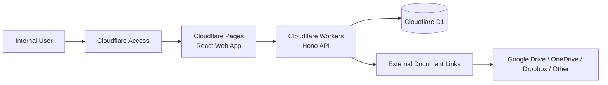

# Ratama Project & Finance Tracker

Internal project and finance workflow system for **Ratama**, built to connect the commercial pipeline with project execution and financial tracking in one operational application.

The application follows a business process from **client and opportunity management** through **project delivery, invoicing, payments, payables, and management reporting**. It is designed as a lightweight internal system running on the Cloudflare platform.

> **Current status:** MVP implemented and verified in staging. Production deployment is intentionally pending production-readiness approval.

## Overview

Operational information can become fragmented when sales, project delivery, and finance are tracked independently. Ratama Project & Finance Tracker brings those workflows into a single system with a shared data model and audit trail.

The main flow is:

```text
Client
  ↓
Opportunity
  ↓
Won / Deal
  ↓
Project
  ↓
Project Activities
  ↓
Invoice
  ↓
Payment
  ↓
Payables
  ↓
Dashboard & Reports
```

The system also supports external document references for proposals, contracts, purchase orders, project documents, invoices, and payment evidence without storing the binary files inside the application.

## Core Modules

### Clients

Manage client records and contacts as the foundation for commercial and project activity.

- Client lifecycle and status
- Multiple client contacts
- Primary contact management
- Search and filtering
- Soft deletion

### Opportunities

Track commercial activity from initial opportunity through proposal, follow-up, negotiation, win, loss, or hold.

- Opportunity pipeline
- PIC assignment
- Opportunity activity logs
- Deal value tracking
- Status transitions
- Lost / held opportunity handling
- External proposal and contract references

### Projects

Convert business opportunities into operational projects and track delivery progress.

- Project ownership and PIC
- Project members
- Progress percentage
- Deadlines
- Blockers and next actions
- Project activity history
- Project document references

### Finance

Connect project execution with receivables and operational costs.

- Invoices
- Payment recording
- Automatic invoice payment-state synchronization
- Accounts payable / vendor bills
- Due-date and overdue tracking
- Project-linked financial records

### Dashboard

Provide an operational overview for management.

- Client summary
- Opportunity summary
- Project health
- Receivable overview
- Payable overview
- Overdue invoices and payables
- Status breakdowns

### Users & Access

Authentication and application authorization use two layers:

1. **Cloudflare Access** verifies who may reach the internal application.
2. The application `users` table controls role and account status.

Supported application roles:

- `OWNER`
- `ADMIN`
- `STAFF`

User management is restricted to OWNER and ADMIN roles.

### Audit Logs

Important mutations are recorded for traceability.

Tracked actions include:

- create
- update
- delete
- workflow transition
- finance-related changes

Audit records capture the actor, affected entity, old/new values, request metadata, and timestamp.

## Architecture



The frontend never accesses D1 directly. Business rules, validation, authorization, and persistence are handled by the Worker API.

## Why External Document Links?

The MVP deliberately does **not** implement binary document uploads.

Documents such as proposals, contracts, SPK, PO, invoice PDFs, payment proofs, and project files remain in an approved external storage provider. The application stores only metadata and the document URL.

This keeps the active architecture focused on:

- Cloudflare Pages
- Cloudflare Workers
- Cloudflare D1
- Cloudflare Access

Cloudflare R2 is not required by the current MVP.

## Tech Stack

| Layer | Technology |
| --- | --- |
| Frontend | React 19, Vite, TypeScript |
| Routing | React Router |
| Data fetching | TanStack Query |
| Forms | React Hook Form |
| Styling | Tailwind CSS |
| UI | Radix / shadcn-compatible primitives |
| API | Hono |
| Runtime | Cloudflare Workers |
| Database | Cloudflare D1 |
| ORM | Drizzle ORM |
| Validation | Zod |
| Authentication gate | Cloudflare Access |
| Hosting | Cloudflare Pages |
| Package management | pnpm workspace |

## Repository Structure

```text
rmc/
├── apps/
│   ├── api/              # Hono API running on Cloudflare Workers
│   └── web/              # React + Vite frontend
├── packages/
│   ├── db/               # D1 schema, Drizzle definitions, migrations
│   ├── shared/           # Shared application types and utilities
│   └── validation/       # Shared Zod validation schemas
├── docs/
│   ├── api-spec.md
│   ├── business-flow.md
│   ├── cloudflare-foundation.md
│   ├── database-schema.md
│   ├── deployment.md
│   ├── plan.md
│   └── techstack.md
├── scripts/              # Local verification / smoke-test tooling
├── package.json
└── pnpm-workspace.yaml
```

## Data Model

The active MVP schema includes:

```text
users
clients
client_contacts
opportunities
opportunity_logs
projects
project_members
project_activities
invoices
payments
payables
document_links
audit_logs
```

The business entities are intentionally connected so that a transaction can be traced from commercial activity to project delivery and finance.

## API Areas

The Worker exposes API modules for:

```text
/api/health
/api/auth/me
/api/users
/api/clients
/api/opportunities
/api/projects
/api/invoices
/api/payments
/api/payables
/api/dashboard/summary
/api/document-links
/api/audit-logs
```

See [docs/api-spec.md](docs/api-spec.md) for the detailed contract.

## Local Development

### Prerequisites

- Node.js
- pnpm
- Cloudflare Wrangler authentication for Cloudflare-connected operations

### Install dependencies

```bash
pnpm install
```

### Apply local D1 migrations

```bash
pnpm db:migrate:local
```

### Run the API

```bash
pnpm dev:api
```

The local Worker runs on:

```text
http://localhost:8787
```

### Run the frontend

In another terminal:

```bash
pnpm dev:web
```

The Vite development server is available on its local development port and proxies application API traffic to the Worker during development.

## Quality Checks

Run the project checks before deployment:

```bash
pnpm lint
pnpm typecheck
pnpm build:web
pnpm build:api
```

The repository also includes a local Phase 14 smoke suite covering critical MVP flows:

```bash
pnpm test:phase14:local
```

The smoke flow covers areas such as user access, clients, opportunities, projects, invoice/payment synchronization, payables, and document links.

## Deployment Model

Three environments are defined:

| Environment | Frontend | API | Database |
| --- | --- | --- | --- |
| Local | Vite | Wrangler dev | Local D1 |
| Staging | Cloudflare Pages | Cloudflare Worker | `rmc_staging` |
| Production | Cloudflare Pages | Cloudflare Worker | `rmc_production` |

Staging has already been deployed and verified behind Cloudflare Access.

Production infrastructure is deliberately kept separate and is not deployed until staging acceptance and production configuration are explicitly completed.

Deployment details are documented in [docs/deployment.md](docs/deployment.md).

## Current MVP Status

Completed:

- [x] Monorepo foundation
- [x] Cloudflare staging foundation
- [x] D1 schema and migrations
- [x] Cloudflare Access integration
- [x] Application roles and Users Management
- [x] Client management
- [x] Opportunity management
- [x] Project and activity management
- [x] Invoice management
- [x] Payment management
- [x] Payables
- [x] Dashboard summary
- [x] External document link management
- [x] Audit logs
- [x] Core frontend workflows
- [x] Local critical-flow smoke testing
- [x] Staging deployment
- [x] Staging custom domain and Access verification

Pending:

- [ ] Production D1 configuration
- [ ] Production deployment
- [ ] Post-MVP reporting refinements
- [ ] Ongoing operational hardening

See [docs/plan.md](docs/plan.md) for the implementation history and detailed phase status.

## Documentation

| Document | Description |
| --- | --- |
| [Business Flow](docs/business-flow.md) | End-to-end operational workflow and business rules |
| [API Specification](docs/api-spec.md) | API contracts and endpoint behavior |
| [Database Schema](docs/database-schema.md) | Active D1 schema and migration notes |
| [Tech Stack](docs/techstack.md) | Architecture and technology decisions |
| [Deployment](docs/deployment.md) | Local, staging, and production deployment model |
| [Cloudflare Foundation](docs/cloudflare-foundation.md) | Cloudflare resource and Access setup |
| [Implementation Plan](docs/plan.md) | Project phases, verification, and current status |

## Security Notes

This repository does not require application passwords or API secrets to be committed.

Operational access is expected to be controlled through Cloudflare Access and application-level role/status checks. Environment secrets and production configuration should be managed outside source control.

The staging application is protected and is not intended as a public demo.

## Project Context

Ratama Project & Finance Tracker is a real-world internal system project developed to model and improve an operational workflow spanning **marketing/sales, project execution, and finance**.

The project also serves as an applied software-engineering case covering requirements analysis, system design, architecture, implementation, access control, deployment, and verification.

---

Developed by **Muhammad Alfarizi Habibullah**  
[GitHub](https://github.com/alfrzhb) · [Portfolio](https://alfrzhb.com)
